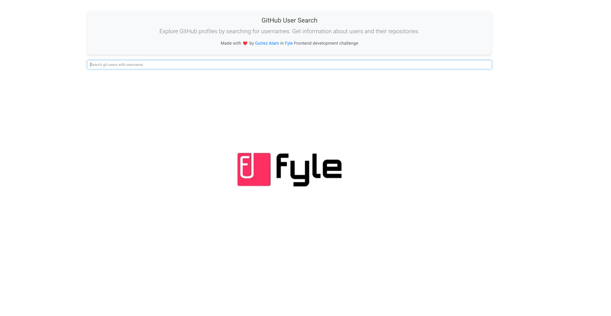
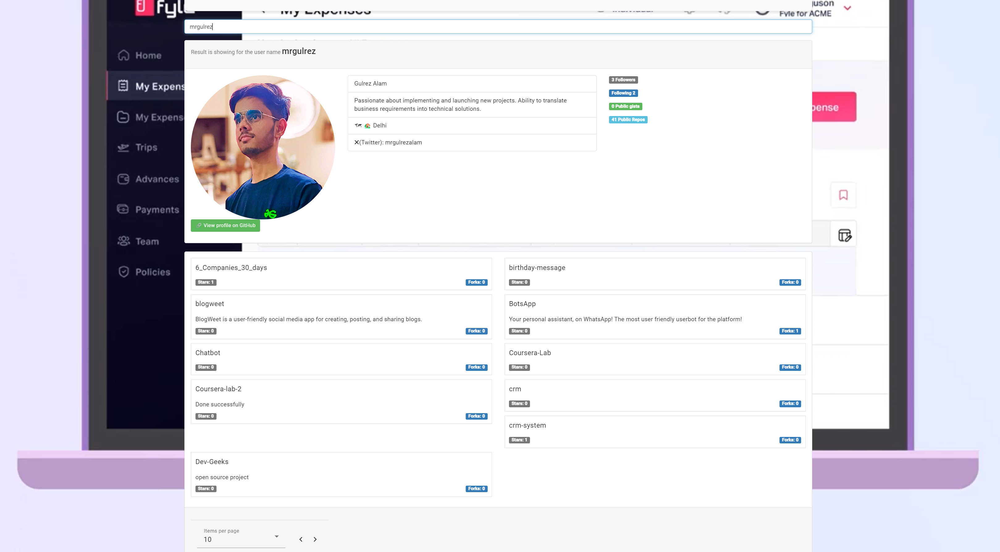

# Fyle Frontend Challenge [(Live)](https://fyle2023.netlify.app/)





## Who is this for?

This challenge is meant for candidates who wish to intern at Fyle and work with our engineering team. The candidate should be able to commit to at least 6 months of dedicated time for the internship.

## Why work at Fyle?

Fyle is a fast-growing Expense Management SaaS product with a ~40 strong engineering team. We are an extremely transparent organization. Check out our [careers page](https://careers.fylehq.com) for a glimpse of what it is like to work at Fyle. Read stories from our teammates [here](https://stories.fylehq.com) and our Glassdoor reviews [here](https://www.glassdoor.co.in/Reviews/Fyle-Reviews-E1723235.htm).

## Challenge Outline

This challenge involves implementing an application using the GitHub API. The services that you need to use are already implemented - check out ApiService. You can see details of this challenge [here](https://fyleuniverse.notion.site/fyleuniverse/Fyle-Frontend-development-challenge-cb5085e5e0864e769e7b98c694400aaa).

__Note__ - This challenge is in Angular. We work on Angular frameworks, and after you join, we expect the same from you. Hence, it is required to complete this assignment in Angular itself.

## Unit Test and Image

## Unit Test

Unit tests are an essential part of the development process to ensure the reliability and correctness of the application. While there is no dedicated `tests` directory in this repository, you are encouraged to write unit tests for your Angular components, services, and other relevant parts of your application.

To run the unit tests, you can use the Angular CLI command:

```bash
ng test


## What Happens Next?

You will hear back within 48 hours from us via email.

## Installation

1. Fork this repository to your GitHub account.
2. Clone the forked repository and proceed with the steps mentioned below.

### Install Requirements
* Install Angular CLI [Ref](https://angular.io/cli)
* Run `npm install` in this repository 

## Development Server

Run `ng serve` for a dev server. Navigate to http://localhost:4200/. The app will automatically reload if you change any of the source files.

## Further Help

Visit the [Angular Documentation](https://angular.io/guide/styleguide) to learn more. Styling is to be strictly done with [Tailwind](https://tailwindcss.com/docs/installation).
